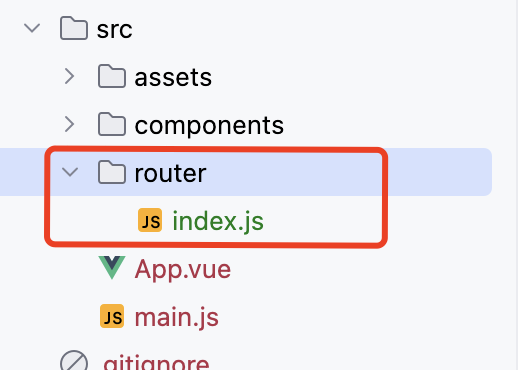

## 目录

- [初始化和安装组件](#初始化和安装组件)
- [项目初始化步骤](#项目初始化步骤)


## 初始化和安装组件

在项目的目录下执行命令 `npm install vue-router@4` 即可安装完成，也就是 package.json 同级的目录。

通过验证该文件内是否出现 `vue-router:"^4.3.0"` 来确定是否安装成功

## 项目初始化步骤

1. 新建目录和文件，用来保存路由配置, 为： `/src/router/index.js`




2. 增加路由配置  `/src/router/index.js`

```js
import loginMain from '@/components/login/loginMain.vue';
import {createRouter, createWebHashHistory} from "vue-router";

// 路由规则
const routes = [
    { path: '/', alias:["/login","/index" ], component: loginMain }, // 默认路由, alias是别名，通过这个路径可以访问同一个页面
    { path: '/principal', component: () => import('@/components/principal/principal.vue') },
    // localhost:5173/#/user/123/name/456  ,通过这样进行参数传递, 后面的问号代表可以不传递name参数
    // name 属性是用来进行函数式编程跳转的
    { path : '/user/:id/name/:name?', name:"userName", component: () => import('@/components/user/user.vue')},
    {
        path: '/vip',  // localhost:5173/#/vip
        component: () => import('@/components/vipMain.vue'),
        children:[
            {   path: "",   // localhost:5173/#/vip   默认加载的页面
                component: () => import('@/components/vip/default.vue')
            },
            {   path: "order",  // localhost:5173/#/vip/order   子组件路由
                component: () => import('@/components/vip/order.vue')
            },
            {   path: "info", // localhost:5173/#/vip/info   子组件路由
                component: () => import('@/components/vip/info.vue')
            }
        ]
    }
];

// 路由器创建
const router = new createRouter({
    history: createWebHashHistory(),
    routes,
});

export default router;
```

3. 修改 `main.js`

```js
import {createApp} from 'vue';
import App from './App.vue';
import router from './router'; // 引入路由配置

const app = createApp(App);
app.use(router);
// 全局前置守卫 ： 拦截所有路由的跳转
router.beforeEach((to, from , next) => {
    console.log("全局前置守卫");
    console.log("即将进入的路由的信息 to: " , to);
    console.log("即将离开的路由的信息 from: " , from);

    if(to.path === "/principal" && from.path !== "/"){
        console.log("拦截")
        next(false);  
    }else {
        console.log("不拦截")
        next()  
    }
})
app.mount('#app');
```

4. 在 `App.vue` 中引入组件

```vue
<template>
  <!-- 引入该标签即可 router-view -->
  <router-view/>
</template>

<script>

</script>
<style scoped>

</style>
```

5. 配置为根路径的vue文件 `/src/components/login/loginMain.vue`

```vue
<template>
<button id="loginButton" @click="loginButton" @click.prevent  type="button" value="登录">登录</button>
</template>

<script >
import LoginCotrol from "@/components/login/loginCotrol"
import principal from "@/components/principal/principal.vue"
export  default {
  data() { return {} },
  methods: {
    // 点击了登录按钮
    async loginButton() {
          // 切换页面
          this.tabChange();
    },
    tabChange() {
      this.$router.push('/principal');
    }
  }
}
</script>
```

6. `src/components/principal/principal.vue`

```vue
<template>
<h1>main</h1>
  <hr>
  <!-- 获得地址栏传递的参数, 127.0.0.1:5173:/pincipal?id=123&title=abc -->
  <p style="color: black">id:{{$route.query.id}}</p>
  <p style="color: black">title:{{$route.query.title}}</p>

  <router-link to="/user/123/name/456" >跳转到user页面 并携带参数</router-link> <br>
  <router-link to="/principal?id=123&title=abc" >跳转到pincipal页面 并携带参数</router-link> <br>
  <router-link :to="{path:'/principal', query:{id:200, title:'abc'} }"> 查询字符串传参 跳转到user页面， 动态属性绑定</router-link> <br>
  <router-link :to="{name:'userName', params:{id:300, name:'value1'}}"> 路由命名传参 跳转到user页面， 动态属性绑定 </router-link> <br>
<!--  按钮跳转 -->
  <button @click="goTo()">跳转按钮</button>
</template>
<script setup>
import {useRouter} from "vue-router";
const router = useRouter();
const  goTo = () => {
  // 都是可以跳转的
  // router.push({name:'userName', params:{id:300, name:'value1'}});
  // router.push('/principal?id=123&title=abc')
  router.push('/user/123/name/456')
}
</script>
```

7. `src/components/user/user.vue`

```vue
<template>
<h1>user</h1>
<!--  localhost:5173/#/user/123/name/456  ,通过这样进行参数传递 -->
  <p style="color: black">id:{{$route.params.id}}</p>
  <p style="color: black">name:{{$route.params.name}}</p>
</template>
<script>
</script>
```

8. `src/components/vipMain.vue`

```vue
<script setup>
import Header from "@/components/sharedViews/header.vue"
import Footer from "@/components/sharedViews/footer.vue"
</script>

<template>
  <!--会员main初始页面,加载两个共享组件，和子路由组件-->
  <Header/>
  <h2>会员main初始页面</h2>
  <router-view/>
  <Footer/>
</template>
```

9. `src/components/vip/default.vue`

```vue
<script setup>
</script>
<template>
  <h2>会员默认页</h2>
</template>
```

10. `src/components/vip/info.vue`

```vue
<script setup>
</script>
<template>
  <h2>会员 info 页面</h2>
</template>
```

11. `src/components/vip/order.vue`

```vue
<script setup>
</script>
<template>
<h2>会员 order 页面</h2>
</template>
```

12. `src/components/sharedViews/footer.vue`

```vue
<script setup>
</script>
<template>
<h2>共享页面头部</h2>
</template>
```

13. `src/components/sharedViews/header.vue`

```vue
<script setup>
</script>
<template>
  <h2>共享页面尾部</h2>
</template>
```


