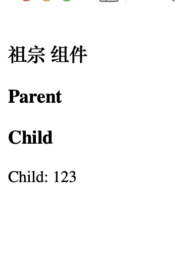

## 目录

- [依赖注入](#依赖注入)


## 依赖注入

- `App.vue`

```vue
<template>
  <h3>祖宗 组件</h3>
  <Parent />
</template>

<script>
import Parent from "./Parent.vue"
  export default {
    components:{
      Parent
    },
    data(){
     return {
       pmessage : "祖宗的财产"
     }
    },
    // 为所有的后代组件提供的数据，无论多少层都可以
    provide:{
        message: "123",
        // getInfo(){
        //   return "传递的函数";
        // }
    }

  }
</script>
```

- 子组件1  `Parent.vue`

```vue
<template>
  <h3>Parent</h3>
  <Child/>
</template>

<script>
import Child from "./Child.vue"
export default {
  components:{
    Child
  }
}
</script>
```

- 子组件  `Child.vue`

```vue
<template>
  <h3>Child</h3>
  <p> Child: {{ cmessage }}</p>
<!--  <p> Child: {{ getInfo() }}</p>-->
</template>

<script>

export default {
  // 接收来自 父组件的父组件的 数据，透传
  // 传递的数据和函数
  inject:{
    message:"message",
    // getInfo:"getInfo"
  },
  data(){
    return {
       cmessage : this.message,
    }
  },
}
</script>


```

- 显示效果：


