## 目录

- [整体项目结构与目录](#整体项目结构与目录)
- [基础页面语法](#[基础页面语法)
- [style样式绑定](#style样式绑定)
- 


## 整体项目结构与目录

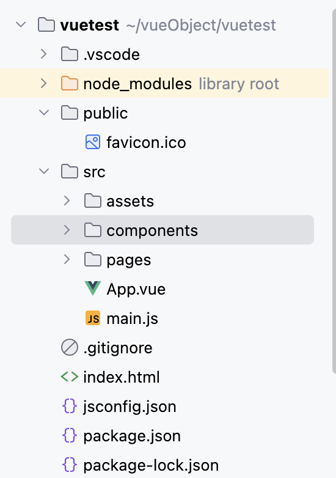

- public 为资源目录
- src  源代码目录
- components  是组件目录（代码位置）
- App.vue  是第一个启动的组件


## 基础页面语法

基础开发最基本的内容就是关联 App.vue  这个文件。


**新建一个简单页面，并展示出来**

- `App.vue`

```vue
<template>
  <!-- 模板语法 ， 会将 data 中返回的 message 写入到该位置,并展示 -->
  <p>{{ message }}</p>
	<!-- 这里引用 HelloWorld.vue 文件中的代码并展示  -->
	<HelloWorld/>
</template>


<script>
// import 是引入组件， 组件名必须和文件名一致
import HelloWorld from "./components/HelloWorld.vue"

export default{
  // components  注入组件
  components:{
    HelloWorld
  },
  data(){
    return {
      message :"组件基础组成"
    }
  }
}
</script>
```

- 新建文件 `src/components/HelloWorld.vue`

```vue
<template>
<hr/>
<div v-bind:id="dynamicId" v-bind:class="dynamicClass">测试</div>
<button  v-bind:disabled="isButton">Button</button>  <!-- disabled=true 代表不可点击 -->
<div v-bind="objectOfAttrs">测试整体替换</div>
<hr/>
</template>

<script>
export default{ 
  data() {
    return {
      dynamicClass: "appclass",
      dynamicId : "appid",
      isButton: true ,
      objectOfAttrs: {
        id: "appid",
        class: "appclass",
      }
    }
  }
}
</script>

<style>
.appclass{
  color: red;
  font-size: 30px;
}
</style>
```

- 效果如下：

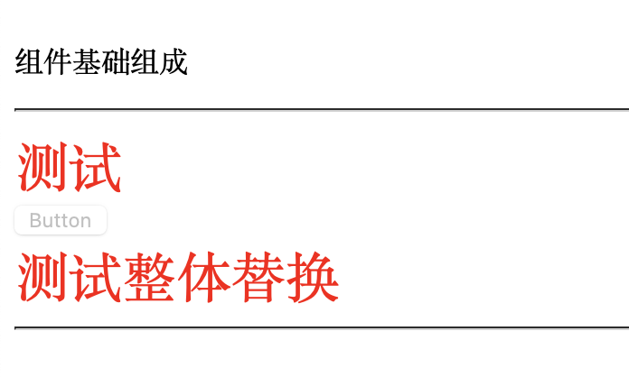


## style样式绑定

- `App.vue`

```vue
<template>
	<StyleBind/>
</template>


<script>
import StyleBind from "./components/StyleBind.vue"

export default{
  components:{
    StyleBind
  },
  data(){
    return {
    }
  }
}
</script>
```

- 新建文件 `src/components/StyleBind.vue`

```vue
<template>
<h3> style 样式绑定</h3>
<p v-bind:style="{color:activeColor, fontSize:fontSize + 'px'}">style绑定1</p>
<!-- 配置颜色样式为 activeColor 对象指定的 red 值, 字体大小指定为 30, 后面再连接上单位px  -->
 <p :style="styleObject">style绑定2 对象绑定</p>
 <p :style="[styleObject]">style绑定3 数组绑定</p>

</template>

<script>
export default {
    data(){
        return {
            activeColor:'red',
            fontSize: '20',
            styleObject:{
                color:'green',
                fontSize:'20px',
                fontWeight:'bold'
            },
            
        }
    }
}
</script>

<style>
.cat{
    color: green;
    font-size: 30px;
}
</style>
```

- 效果如下：

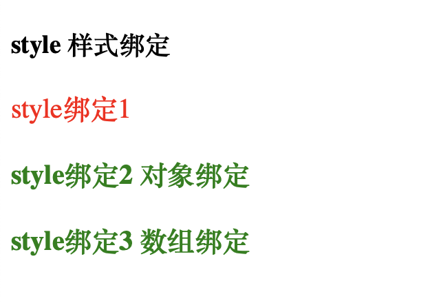

## 计算属性

- 新建文件 `src/components/ComputedDemo.vue`

```vue
<template>
    <h2>计算属性</h2>
    <h3>{{ itbaizhan.name }}</h3>
    <p>{{ itbaizhan.coutent.length > 0 ? 'Yes' : 'No' }}</p>
    <!-- 上面的p标签 会显示yes, 因为coutent数组长度大于0 -->
    <p>{{ itbaizhanContent }}</p>
    <!-- 跟上面是一样的，只不过调用了计算属性 , 调用函数需要在名字后面加括号，而计算属性不可以放括号 -->
</template>


<script>
export default {
  data(){
    return {
        itbaizhan:{
            name:"itbaizhan",
            coutent:["c++","python","java"]
            
        }
    }
  },
  //computed 表示 计算属性, 该属性计算的内容会被缓存起来，下次调用的时候直接使用缓存
  //computed属性的计算结果会缓存，除非相关依赖发生改变。
  computed:{
    itbaizhanContent(){
        return this.itbaizhan.coutent.length > 0 ? 'Yes' : 'No';
    }
  }
}
</script>
```

- 效果如下：

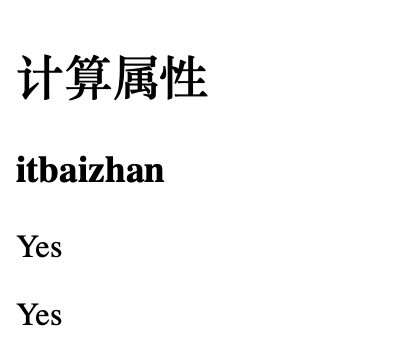

## class属性绑定

- 新建文件 `src/components/ClassDemo.vue`

```vue
<template>
<p v-bind:class="{'active':isActive , 'text-danger':hasError }" > Class 样式绑定</p>
<!-- 如果 isActive 返回 ture, 则 active 类名会被添加到元素上，否则会被移除。 -->
<p v-bind:class="classObject" > Class 样式绑定2</p>
<!-- 可以直接等于一个数组对象  -->
<p v-bind:class="[activeClass,errorClass ]" > Class 样式绑定3</p>
<!-- 还可以等于数组， 每个对象的值都是一个类名  -->
<p v-bind:class="[isActive ? 'active' : '' ]" > Class 样式绑定4</p>
<!-- 如果  isActive 值为true ,则赋予 active 类属性,也可以将属性字符串换成对象-->
<p v-bind:class="[{'text-danger':hasError }, isActive ? 'active' : '' ]" > Class 样式绑定4</p>
<!-- 数组嵌套对象的写法 -->
</template>
<script>
export default {
    data(){
        return {
            isActive : true,
            hasError : true,
            // 绑定一个对象
            classObject : {
                'active':true,  // 启用这个 绑定class 属性
                'text-danger':true
            },
            // 绑定多个类
            activeClass:'active',
            errorClass:'text-danger'
        }
    }
}
</script>
<style>
.active{
    color:red;
    
}
.text-danger{
    font-size: 20px;
}
</style>
```

- 效果如下：

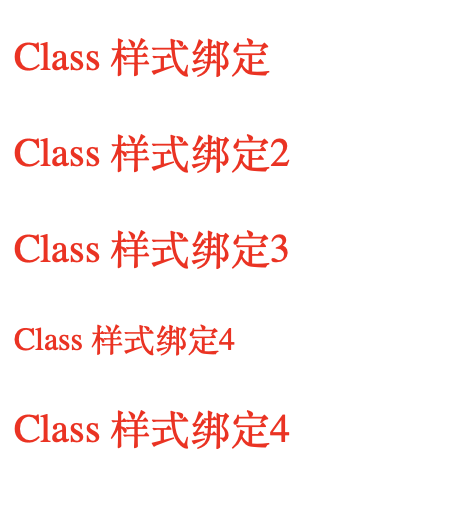

## 条件渲染

- 新建文件 `src/components/ifDemo.vue`

```vue
<template>
        <hr/>
    <h3>条件渲染</h3>
    <div>
        <div v-if="flag">是否可见</div>
        <div v-else>上面不可见就会见到这个，与上面的 v-if成套 </div>
    </div>
    <div>
        <!-- 成套的 else if 判断 -->
        <div v-if="type === 'A'">is  A </div>
        <div v-else-if="type === 'B'">is  B </div>
        <div v-else-if="type === 'C'">is  C </div>
        <div v-else>is not A/B/C </div>
    </div>
    <div v-show="flage">v-show 可见性</div>
    <!-- flage 等于 false时， 实际会变成这样的 <div style="display: none;">v-show 可见性</div> -->
    <hr/>
</template>

<script>
export default {
    data (){
        return {
            flag: false,  // 是否可见， 控制上面的 div , v-if 来进行判断，是否渲染该组件
            type: 'A',
            flage: false // 控制 v-show
        }
    }
}
</script>

<style>
</style>
```

- 效果如下：

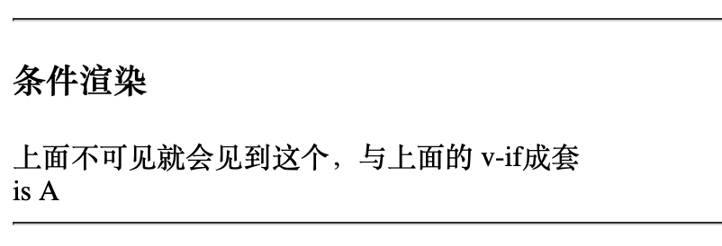

## 列表渲染

- 新建文件 `src/components/ListDemo.vue`

```vue
<template>
    <hr/>
    <h3>列表渲染</h3>
    <div>
        <p v-for="item in names">{{ item }}</p>  <!-- item代表每个names的变量 , in 和 of 都是一样的-->
        <p v-for="(item,index) of iphones"> 下标为{{ index }} ,成员为： {{ item.id }}  {{ item.email }}</p>  <!-- index是数组下标 -->
    </div>
    <div>
        <p v-for="(item, key ,index) of userInfo"> userInfo 对象 ： value: {{ item }} ,key: {{ key }} , index:{{ index }}</p>
            <!-- 上面也会进行循环遍历，只不过每次都是读取的key值，共循环三次,  for 对象就可以传递三个值，数组不行 -->
    </div>
    <h3>key属性添加到 v-for 中</h3>
    <div>
        <p v-for="(item, index) of dataInfo" :key="item.id">{{ item }}</p>
        <!-- key代表唯一索引， 避免vue进行重新渲染-->
    </div>
    <hr/>
</template>

<script>

export default {
    data(){
        return { 
            names:[ // 数组
                "1","2","3","4"
            ],
            iphones:[  // json 数组
                {"id":"iphone1", "email":"@1"},  //是否有 双引号 不影响正读取
                {id:"iphone2", email:"@2"},
                {id:"iphone3", email:"@3"},
            ],
            userInfo:{      // 对象
                name:"张三",
                age:18,
                sex:"男"
            },
            dataInfo:[
                { "id": 10 , "name": "张零" , "email": "@1"},
                { "id": 13 , "name": "张三" , "email": "@2"},
                { "id": 12 , "name": "张二" , "email": "@3"},
                { "id": 11 , "name": "张一" , "email": "@4"}
            ]
        }
    }
}
</script>
```

- 效果如下：

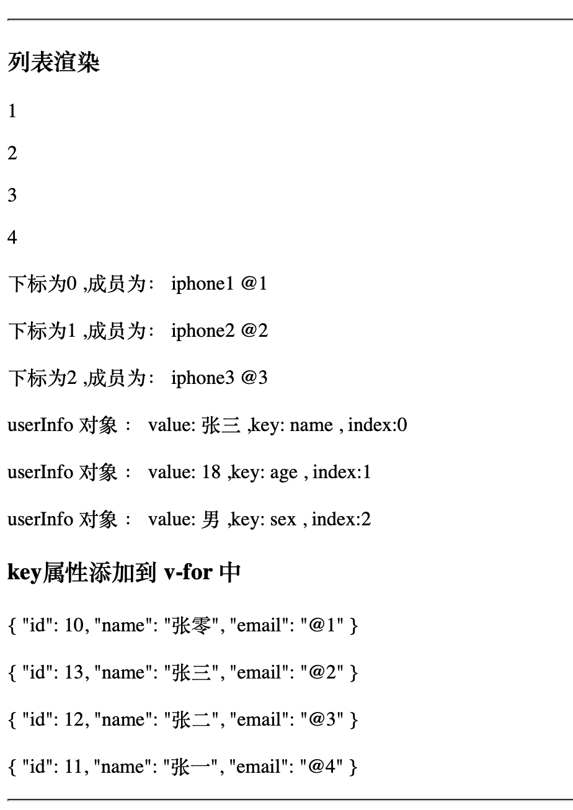

## 表单输入绑定

- 新建文件 `src/components/MoudleDemo.vue`

```vue
<template>
    <h3>表单输入绑定</h3>
    <div>
        <form>
            <input type="text" v-model="message" @click.prevent />
            <p>{{ message }}</p>
            <!-- v-model 会将 input 元素的 value 绑定到 message 上, 并且是实时更新的 -->
             <!-- @click.prevent 用来阻止默认事件 -->
        </form>
    </div>
    <div>
        <!-- 单选框和多选框绑定 -->
         <input type="checkbox"  id="checkbox" v-model="checked"/>
         <label for="checkbox">{{ checked  }}</label>
         <!-- label 中的for 代表绑定的input id ,label 会直接显示false或true --> 
    </div>
    <div>
        <!-- 懒惰获取，不是实时的 ,就添加 .lazy  ，当失去鼠标焦点的时候 才会触发 -->
         <input type="text" v-model.lazy="lazyMessage" />
         <p>{{ lazyMessage }}</p>
    </div>
    <div>
        <!-- number 指定输入的为数字 , trim 去掉首尾空格 -->
        <input type="text" v-model.number.trim="checkedNames" />
        <p>{{ checkedNames }}</p>
    </div>

</template>
<script>
export default{
    data(){
        return {
            message:"",
            checked:false,    // 这里也可以直接给定默认值
            lazyMessage:"",
            checkedNames:0
        }
    }
}
</script>
```

- 效果如下：

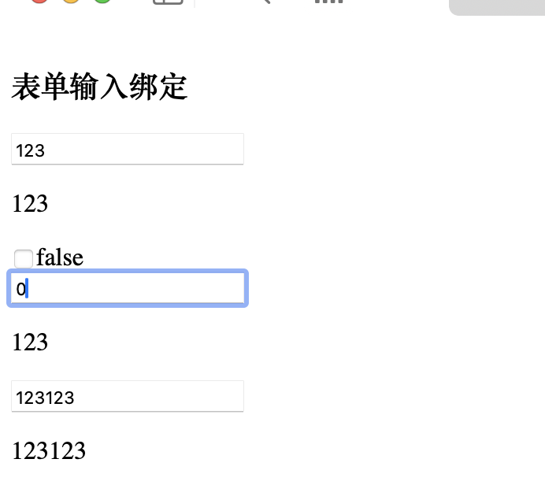

## 侦听器

- 新建文件 `src/components/WatchDemo.vue`

```vue
<template>
    <h3>侦听器</h3>
    <!-- 只能侦听能够拿到的数据， 包括 script 标签中 data() 属性的数据 -->
     <p> {{  message }}</p>
     <button @click="updateHandle">修改数据</button>
</template>

<script>
export default {
    data(){
        // 下面的数据都能侦听
        return {
            // 这个数据如果想要侦听的话，就得在 watch下面给个同名的函数。
            message:"Hello"
        }
    },
    methods:{
        updateHandle(){
            this.message = "Hello World"
        }
    },
    watch:{
        // 侦听器, newValue 新值， oldValue 原值
        message(newValue,oldValue){
            console.log("newValue",newValue);
            console.log("oldValue",oldValue);
            // 这里可以添加 相应的处理函数了
        }
    }
}
</script>
```

- 效果如下：

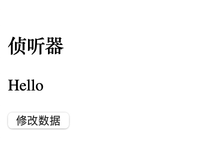


## 数组变化侦听

- 新建文件 `src/components/ArrayList.vue`

```vue
<template>
    <h3>数组变化侦听</h3>
    <button @click="addListHandler">添加数据</button>
    <button @click="replacerListHandler">替换数据</button>
    <ul>
        <li v-for="(item,index) in names" :key="index">{{ item }}</li>
    </ul>

</template>
<script>
export default {
    data(){
        return {
            names:["张三","李四","王五","赵六"]
        }
    },
    methods:{
        addListHandler(){
            // push 会引起ui自动更新
            // this.names.push("张一");
            // concat 不会引起ui自动更新，会合并返回一个新数组,直接替换原数组 也会更新UI
            this.names = this.names.concat(["张玩"]);
            console.log(this.names);
        },
        replacerListHandler(){
            this.names = ["张一","张二","张三","张四","张五"];
        }
    }
}

</script>
```

- 效果如下：

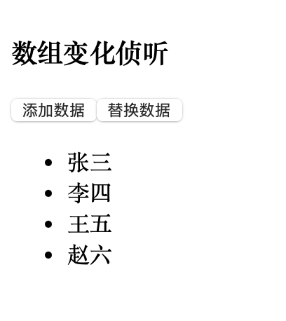

## 组件注入

- 新建文件 `src/components/Components.vue`

```vue
<template>
  <div class="container">{{ message }}</div>

  <!--  显示组件-->
  <MoudleDemo/>
  <DomElemDemo/>
</template>


<script>
// import 是引入组件， 组件名必须和文件名一致
import MoudleDemo from "./MoudleDemo.vue";
import DomElemDemo from "./DomElemDemo.vue";

export default{
  // components  注入组件
  components:{
    DomElemDemo:DomElemDemo,
    MoudleDemo:MoudleDemo
  },
  data(){
    return {
      message :"组件基础组成"
    }
  }
}
</script>

<!-- scoped ： 让当前组件的样式只对当前组件有效 , 否则就默认为全局样式-->
<style scoped>
.container{
  font-size: 30px;
  color: red;
}
</style>
```

- 效果如下：

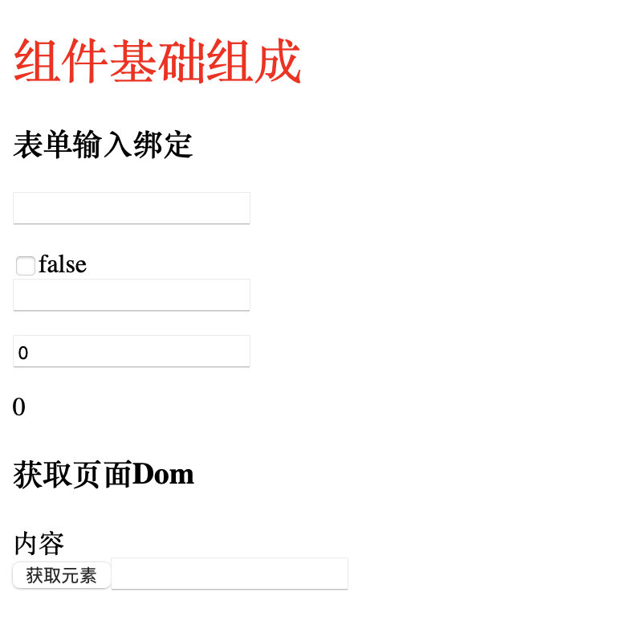

## 获取页面Dom

- 新建文件 `src/components/DomElemDemo.vue`

```vue
<template>
    <h3>获取页面Dom</h3>
    <!-- ref 指定的元素会自动挂载到vue实例的$refs属性上 ，通过this.$refs.content 获取元素 -->
    <div ref="content" class="container" >{{ content }}</div>
    <button @click="getElementHander">获取元素</button>
    <input ref="username" type="text"/>
</template>

<script>

export default{
    data(){
        return {
            content:"内容"
        }
    },
    methods:{
        getElementHander(){
            // 获取元素
            console.log(this.$refs.content);
            var  oldValue = this.$refs.content.innerHTML;
            this.$refs.content.innerHTML = oldValue + this.$refs.username.value;
            console.log(this.$refs.username.value); 
        }
    }
}

</script>
```

- 效果如下：

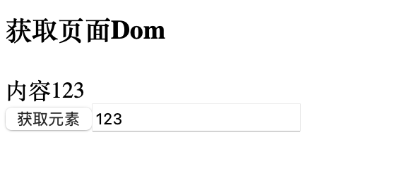

## 内联事件处理器

- 新建文件 `src/components/EventDeom1.vue`

```vue
<template>
    <hr/>
    <h3>内联事件处理器</h3>
    <div>
        <button v-on:click="count++">Add</button>
            <!-- 每次点击按钮后， count就会加1 -->
            <!-- v-on:clock 可以平行替换为  @clock  -->
        <p>{{ count }}</p>
    </div>
    <hr/>
    <h3>方法事件处理器</h3>
        <button @click="addCount">Add methods</button>
        <p>{{ count }}</p>
        
        <!-- 带参数的处理器 -->
        <button @click="addCountElem(count + 1)">Add methods 带参数</button>
        <p>{{ count }}</p>

        <!-- 事件传参 -->
        <p  @click="getName(item, $event)" v-for="(item, index) of names" :key="index">{{ item }}</p>
    <hr/>
</template>

<script>
import ListDemo from "./ListDemo.vue";
export default {
    data(){
        return {
            count:0,
            names:["张三","李四","王五","赵六"]
        }
    },
    // 所有的方法都在methods中定义
    methods:{
        addCount(){
            //  e.target.innerHTML + "Add" + this.addCount;
            this.count += 1;
            console.log("点击了按钮");
        },
        addCountElem(e){
            console.log("e的值：" + e);
            this.count += e;
        },
        getName(name, e){
            console.log("name的值：" + name);
            console.log("event对象的值：" + e);
        }
    }
}

</script>
```

- 效果如下：

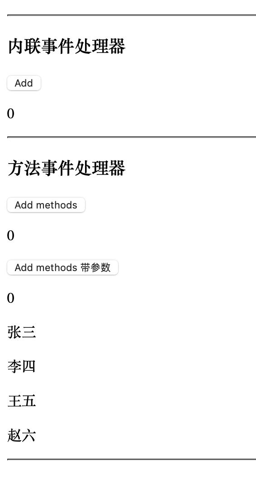

## 事件修饰符

- 新建文件 `src/components/EventDeom1.vue`

```vue
<template>
    <hr/>
    <h3>事件修饰符</h3>
    <div>
        
        <h4>阻止默认事件:</h4>
        <li><a  @click="chickHandle" href="https://baidu.com">百度</a></li>
        <li><a  @click.prevent="chickHandle2" href="https://baidu.com">百度2</a></li>
        <!-- @click.prevent  代替了手动阻止默认跳转的事件，相当于代码 e.preventDefault(); -->
    </div>
    <div>
        <h4>阻止冒泡事件</h4>
        <!-- 冒泡会触发当前元素事件和上层元素的事件，一层一层的传递下去  -->
        <li>测试冒泡</li>
        <div @click="clickDiv">
            <p @click.stop="clickP">测试标签</p>
            <!-- @click.stop 会阻止 冒泡事件 -->
        </div>
    </div>
    <hr/>
</template>

<script>
export default{
    data(){
        return {
            count : 0
        }
    },
    methods:{
        chickHandle(e){
            // 阻止默认事件
            e.preventDefault();
            console.log(e.target);
            console.log("点击了超链接");
        },
        chickHandle2(e){
            console.log("点击了超链接");
        },
        clickDiv(){
            console.log("clickDiv触发");
        },
        clickP(e){
            // 阻止冒泡
            // e.stopPropagation();
            console.log("clickP触发");
        }
    }
    
}
</script>
```

- 效果如下：

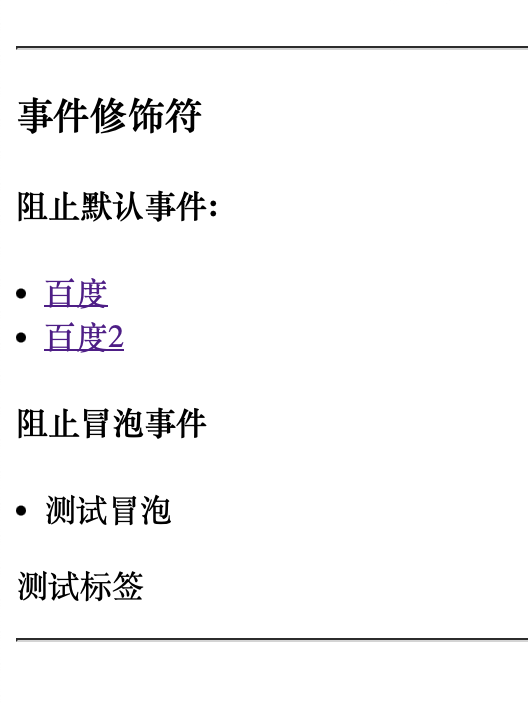