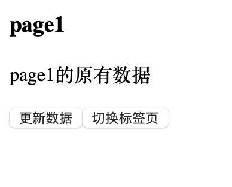
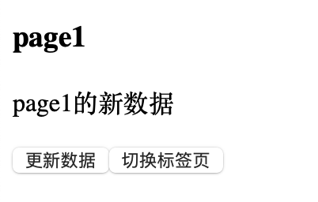
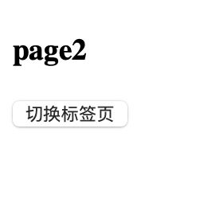

## 目录

- [异步组件加载](#异步组件加载)


## 异步组件加载

这是vue3的特性

- `App.vue`

```vue
<template>
  <!--  这里显示 tabComponent 组件页面-->
<!--  keep-alive 标签的内容会被保存下来，而不会被销毁-->
  <keep-alive>
    <component :is="tabComponent"></component>
  </keep-alive>

  <button @click="changHandle">切换标签页</button>
</template>


<script>
// import 是引入组件， 组件名必须和文件名一致
import page1 from "@/dynamicComponents/page1.vue"

// 这里异步加载了 pack2的组件，只有当切换到该页面的时候才进行网络请求该页面加载
// 上面的 import 固定写法 , 下面则是自定义的 
import {defineAsyncComponent} from "vue";
const page2 = defineAsyncComponent(()=>
    import("@/dynamicComponents/page2.vue")
)

export default{
  // components  注入组件
  components:{
    page1,
    page2
  },
  data(){
    return{
      // 将page1 页面赋值给tabComponent 于指定当前页面的标签组件名
      // 一定要传输组件的字符串名
      tabComponent:"page1",
    }
  },
  methods:{
    changHandle(){
      // 这里进行页面的切换判断
      this.tabComponent  =  this.tabComponent === "page1" ?  "page2" : "page1";
    }
  }

}
</script>
```

- 子组件  `page1.vue`

```vue
<template>
  <h3>page1</h3>
<!--  这个数据会在销毁后消失，再次创建该组件则会变为默认值，
    如果放到 keep-alive 标签内，就会保留更新后的内容。 -->
  <p>{{message}}</p>
  <button @click="changeHandle">更新数据</button>
</template>

<script>
export default {
  data(){
    return{
      message:"page1的原有数据"
    }
  },methods:{
    changeHandle(){
      this.message = "page1的新数据";
    }
  }
}
</script>
```

- 子组件  `page2.vue`

```vue
<template>
  <h3>page2</h3>
</template>

<script>
</script>
```

- 显示效果：



点击 跟新数据 按钮后：



点击切换标签页按钮后：



再次切换，还会保留 pack1的新数据
