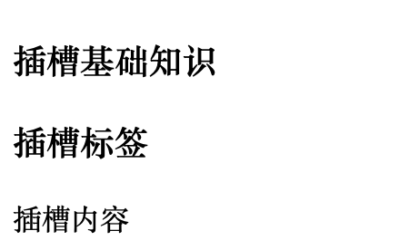
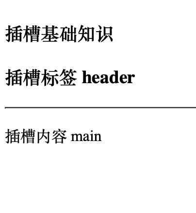
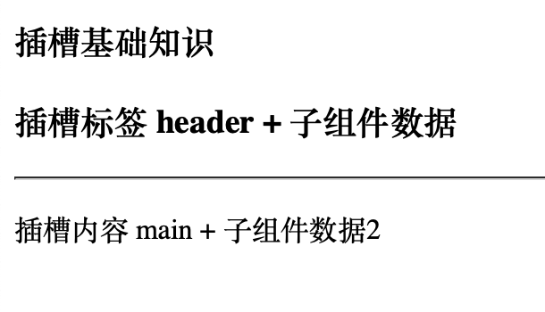

## 目录

- [插槽Slotsl](#插槽Slots)
- [具名插槽](#具名插槽)

- [父子组件参数传递插槽](#父子组件参数传递插槽)
- [具名插槽传递数据](#具名插槽传递数据)


## 插槽Slots

插槽内容可以访问父组件的数据，使用的就是父组件的数据内容。

- `App.vue`

```vue
<template>
  <!-- 传递内容，变为双标签 -->
  <SlotsBase>
<!--    这个标签的内容会传递到 SlotsBase 组件中的 <slot></>slot> 标签中，并进行替换 -->
    <div>
      <h3>{{message}}</h3>
      <p>插槽内容</p>
    </div>
  </SlotsBase>
</template>
<script>
import SlotsBase from "@/components/SlotsBase.vue";


export default{
  components:{
    SlotsBase
  },
  data(){
    return {
      message: "插槽标签"
    }
  }
}
</script>
```

- `/components/SlotsBase.vue`

```vue
<template>
  <h3>插槽基础知识</h3>

<!--  双标签的 slot ,会被父组件传递的内容进行替换，并在当前位置渲染 -->
<!--  如果父组件没有传递任何模板，就显示中间的 插槽默认值 -->
  <slot>插槽默认值</slot>
</template>
<script>
</script>
```

- 渲染效果：



## 具名插槽

- `App.vue`

```vue
<template>
  <!-- 传递内容，变为双标签 -->
  <SlotsBase>
<!--    这个标签的内容会传递到 SlotsBase 组件中的 <slot></>slot> 标签中，并进行替换 -->
      <template v-slot:header>
        <h3>插槽标签 header</h3>
      </template>
			<!--  #  可以平行替换 v-slot: -->
      <template #main>
        <p>插槽内容 main</p>
      </template>
  </SlotsBase>
</template>


<script>
import SlotsBase from "@/components/SlotsBase.vue";


export default{
  components:{
    SlotsBase
  },
}
</script>
```

- 子组件 `src/components/SlotsBase.vue`

```vue
<template>
  <h3>插槽基础知识</h3>

<!--  双标签的 slot ,会被父组件传递的内容进行替换，并在当前位置渲染 -->
<!--  name 代表当前插槽所属的名字 ，会进行插槽值区分 ，传递的时候进行配置  <template v-slot:header> 双标签包裹 -->
  <slot name="header"></slot>
  <hr>
  <slot name="main"></slot>
</template>
<script>
</script>
```


- 渲染效果：



## 父子组件参数传递插槽

子组件将数据通过插槽传递给父组件，然后父组件整合后再通过插槽传递给子组件。

- `App.vue`

```vue
<template>
  <SoltsAttr>
    <template v-slot="slotProps">
      <h3>插槽标签 header + {{ slotProps.msg }}</h3>
    </template>
  </SoltsAttr>
</template>
<script>
import SoltsAttr from "@/components/SoltsAttr.vue";
export default{
  // components  注入组件
  components:{
    SoltsAttr
  },
}
</script>
```

- 子组件 `src/components/SoltsAttr.vue`

```vue
<template>
  <h3>插槽基础知识</h3>

  <!--  双标签的 slot ,会被父组件传递的内容进行替换，并在当前位置渲染 -->
  <!--  name 代表当前插槽所属的名字 ，会进行插槽值区分 ，传递的时候进行配置  <template v-slot:header> 双标签包裹 -->
  <!--  ：msg 就是传递过去的键值， childMessage 是实值 -->
  <slot :msg="childMessage"></slot>
</template>
<script>
export  default {
  data(){
    return {
      childMessage:"子组件数据"
    }
  }
}
</script>
```


## 具名插槽传递数据

- `App.vue`

```vue
<template>

  <!-- 传递内容，变为双标签 -->
  <SlotsBase >
<!--    这个标签的内容会传递到 SlotsBase 组件中的 <slot></>slot> 标签中，并进行替换 -->
      <template v-slot:header="slotPropsHander" >
<!--      slotPropsHander.msg 来获得子组件传递给 name="header" 的数据   -->
        <h3>插槽标签 header + {{ slotPropsHander.msg }}</h3>
      </template>
      <template #main="slotPropsMain">
        <p>插槽内容 main + {{ slotPropsMain.msg2 }} </p>
      </template>
  </SlotsBase>
</template>
<script>
import SlotsBase from "@/components/SlotsBase.vue";
export default{
  // components  注入组件
  components:{
    SlotsBase
  },
</script>
```

- 子组件 `src/components/SlotsBase.vue`

```vue
<template>
  <h3>插槽基础知识</h3>

<!--  双标签的 slot ,会被父组件传递的内容进行替换，并在当前位置渲染 -->
<!--  name 代表当前插槽所属的名字 ，会进行插槽值区分 ，传递的时候进行配置  <template v-slot:header> 双标签包裹 -->
<!--  ：msg 就是传递过去的键值， childMessage 是实值 -->
  <slot name="header" :msg="childMessage"></slot>
  <hr>
  <slot name="main"  :msg2="childMessage2"></slot>
</template>
<script>
export  default {
  data(){
    return {
      childMessage:"子组件数据",
      childMessage2:"子组件数据2"
    }
  }
}
</script>
```

- 渲染效果：


