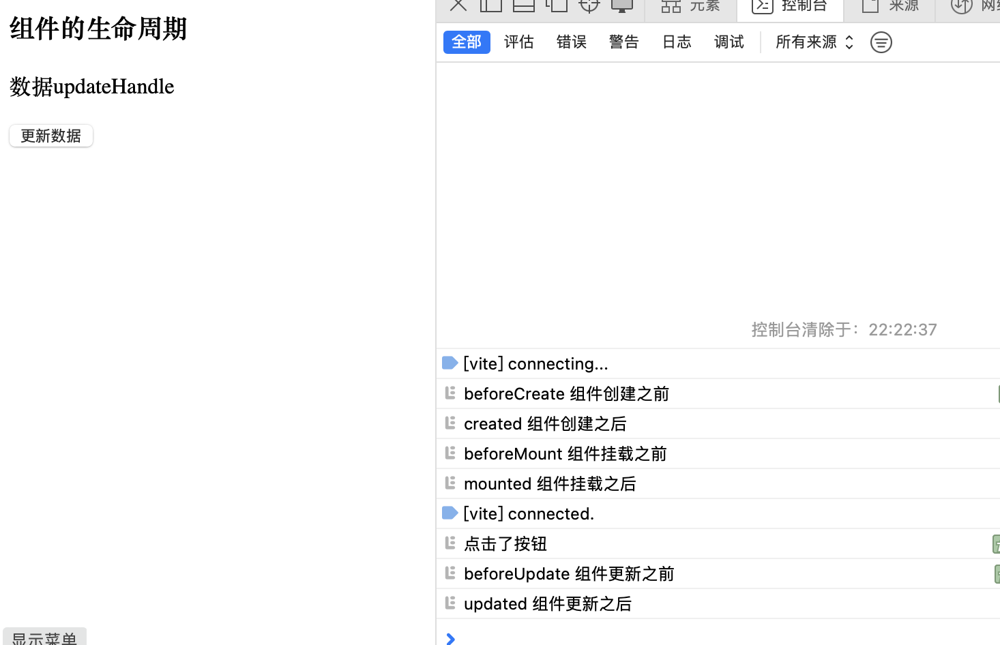

## 目录

- [组件生命周期](#组件生命周期)
- [组件生命周期应用](#组件生命周期应用)


## 组件生命周期

- 组件生命周期函数 (在相应的期间，对应的生命函数都是自动执行的)
  - 创建期： beforeCreate	created
  - 挂载期：beforeMount 	mountd
  - 更新期：beforeUpdate	updated
  - 销毁期：beforeUnmount    unmountd


- `App.vue`

```vue
<template>
  <h3>组件的生命周期</h3>
  <p>{{ message }}</p>
  <button @click="updateHandle">更新数据</button>
</template>


<script>
// import 是引入组件， 组件名必须和文件名一致
import SlotsBase from "@/components/SlotsBase.vue";
export default{
  methods:{
    updateHandle(){
      console.log("点击了按钮")
      this.message =  this.message + "updateHandle"
    }
  },
  // components  注入组件
  components:{
    SlotsBase
  },
  data(){
    return{
      message:"数据"
    }
  },
  beforeCreate() {
    console.log("beforeCreate 组件创建之前")
  },
  created(){
    console.log("created 组件创建之后")
  },
  beforeMount() {
    console.log("beforeMount 组件挂载之前")
  },
  mounted() {
    console.log("mounted 组件挂载之后")
  },
  beforeUpdate() {
    console.log("beforeUpdate 组件更新之前")
  },
  updated() {
    console.log("updated 组件更新之后")
  },
  beforeUnmount() {
    console.log("beforeUnmount 组件卸载之前")
  },
  unmounted() {
    console.log("unmounted 组件卸载之后")
  },
}
</script>
```

- 渲染效果：



## 组件生命周期应用

- `Comment.vue`

```vue
<template>
<h3>组件生命周期函数应用</h3>
  <p ref="name">文本内容</p>
  <ul>
    <li v-for="(item, index) of banner" :key="index" >
        <h3>{{ item.title }}</h3>
        <p>{{ item.content }}</p>
    </li>
  </ul>
</template>

<script>
export default {
  data(){
    return{
      banner:[]
    }
  },
  beforeMount() {
    // 读取 ref="name" 的dom， 但结果是失败的
    console.log(this.$refs.name)
  },
  mounted() {
    // 读取 ref="name" 的dom，结果是成功的
    console.log(this.$refs.name)

    // 组件创建完成之后，就发送网络请求，才能进行写入数据
    this.banner = [
      {
        title:"标题1",
        content:"内容1"
      },
      {
        title:"标题2",
        content:"内容2"
      },
    ]
  }
}
</script>
```


