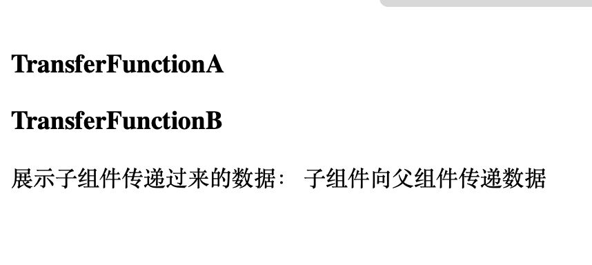

## 目录

- [父向子组件传递参数](#父向子组件传递参数)
- [父向子组件传递参数_带类型限定和默认值](#父向子组件传递参数_带类型限定和默认值)
- [子向父组件传递参数_组件事件](#子向父组件传递参数_组件事件)
- [子向父组件传递参数_侦听器](#子向父组件传递参数_侦听器)
- [子向父组件传递参数_事件类型](#子向父组件传递参数_事件类型)


## 父向子组件传递参数

传递的参数是只读的，不可以进行修改。

- 父组件 ` Parent.vue `

```vue
<template>
  <h3>Parent</h3>
<!-- 当前组件可以传递数据给 Child , 可以传递任何参数，包括字符串，函数，对象 等等。-->
  <Child title="传递的 title 参数" demo="传递的 demo 参数" v-bind:elem2="elem"/>
</template>

<script>

import  Child from "./Child.vue"
export default {
  components:{
    Child
  },
  data(){
    return {
      elem :"Parnt传递的动态参数"
    }
  }
}
</script>
```

- 子组件 `Child.vue`

```vue
<template>
  <h3>Child</h3>
<!--  这里进行传递数据的展示-->
  <p @click="changeTitle">{{ title }}</p>
  <p >{{ demo }}</p>
  <p >{{ elem2 }}</p>
</template>

<script >
export default
{
  // 接收父组件传递过来的数据
  props:["title", "demo", "elem2"],
  // 下面是带校验的写法
  // props:{    title:{      type:String,      default:"我是子组件的默认title"    }  }
  methods:{
    changeTitle(){
      console.log(this.title)
    }
  }
}
</script>
```

- 显示效果:


## 父向子组件传递参数_带类型限定和默认值

- 父组件 ` ComponentA.vue `

```vue
<script >
import ComponentB from './ComponentB.vue'
export  default {
  components:{
    ComponentB
  },
  data(){
    return {
      titleToB:"字符串"
    }
  }
}
</script>

<template>
  <h3>ComponentA</h3>
  <ComponentB :title="titleToB" :arrlst="[1,2,3,4,5,6,7]"/>
</template>
```

- 子组件 `ComponentB.vue`

```vue
<script >
export default {
  data(){
    return {}
  },
  // props 传递的所有参数 都是只读的，不可直接修改
  props:{
    // 会校验传递的 title 参数是否为字符串或数字，如果不是会显示警告信息
    title:{
      type: [String, Number],
      default: "我是子组件的默认title值",
      required:true // 当前参数为必须传递的参数，否则就报警告
    },
    arrlst:{
      // 当传递数组的时候，就得用 函数的方式来返回默认值
      type: Array,
      default() {
        return []   // 默认给空数组
      }
    }
  }
}
</script>

<template>
  <h3>ComponentB</h3>
  <p>{{ title }}</p>
  <p>{{ arrlst }}</p>
</template>

```


- 显示效果:


## 子向父组件传递参数_组件事件

- `app.vue`

```vue
<template>
  <CompoentEventFather/>
</template>


<script>
// import 是引入组件， 组件名必须和文件名一致
import CompoentEventFather from "./components/CompoentEventFather.vue"


export default{
  // components  注入组件
  components:{
    CompoentEventFather
  },
  data(){
    return {
      message :"组件基础组成"
    }
  }
}
</script>
```

- 父组件 ` src/components/CompoentEventFather.vue`

```vue
<template>
  <h3>组件事件</h3>
<!--   自定义的函数事件 someEvent ，关联函数为 getHandle-->
  <CompoentEventChild @someEvent="getHandle"/>
  <p>父组件收到的数据为： {{data}}</p>
</template>

<script>
import CompoentEventChild from "./CompoentEventChild.vue"
export default {
  components:{
    CompoentEventChild
  },
  methods:{
    // 自定义的函数事件 someEvent 的关联函数
    getHandle(data){
      console.log("触发了父组件的自定义事件，并执行了该函数, 数据为：" + data);
      this.data = data;
    }
  },
  data(){
    return {
      data :""
    }
  }
}
</script>
```

- 子组件 ` src/components/CompoentEventChild.vue`

```vue
<template>
<h3>CompoentEventChild</h3>
  <button @click="clickEventHandle">传递数据</button>
</template>

<script>
export default {
  methods:{
    clickEventHandle(){
      console.log("点击了子组件的事件")
      // $emit 两个参数， 第一个是  父组件要实现的事件名称， 第二个是传递给父组件的数据
      this.$emit("someEvent", "我是子组件传递的数据");
    }
  },
  // 声明Vue该组件可能会触发哪些自定义事件， 这个事件实在父组件中的
  emits:[ 'someEvent' ]
}
</script>
```

- 显示效果：


## 子向父组件传递参数_侦听器

- `app.vue`

```vue
<template>
  <SearchMainComponent/>
</template>


<script>
import SearchComponent from "./components/SearchComponent.vue"
import SearchMainComponent from "./components/SearchMainComponent.vue"


export default{
  // components  注入组件
  components:{
    SearchComponent,
    SearchMainComponent
  },
  data(){
    return {
      message :"组件基础组成"
    }
  }
}
</script>


```

- `components/SearchMainComponent.vue`

```vue
<template>
  <h3>SearchMainComponent</h3>
  <p> 搜索内容为： {{searchData}}</p>
  <SearchComponent @searchEvent="getSearch"/>
</template>

<script >
import SearchComponent from "./SearchComponent.vue"
export default {
  components:{
    SearchComponent
  },
  data(){
    return {
      searchData:""
    }
  },
  methods:{
    getSearch(data){
      this.searchData = data;
    }
  },
}
</script>
```

- ` components/SearchComponent.vue)`

```vue
<template>
  搜索 <input type="text" v-model="search" />
</template>

<script >


export default {
  data(){
    return {
      search:""
    }
  },
  // 侦听器
  watch:{
    search(newValue, oldValue){
      // $emit 两个参数， 第一个是  父组件要实现的事件名称， 第二个是传递给父组件的数据
      this.$emit("searchEvent", newValue);
    }
  },
  // 声明会使用到的外部的 事件名称
  emits:["searchEvent"]
}
</script>
```

- 显示效果:


## 子向父组件传递参数_事件类型

- 父组件 `TransferFunctionA.vue`

```vue
<template>
  <h3>TransferFunctionA</h3>
<!--  传递一个函数给子组件-->
  <TransferFunctionB :onEvent="onEvent"/>
  <p>展示子组件传递过来的数据： {{ data }}</p>
</template>
<script>
import TransferFunctionB from "./TransferFunctionB.vue"

export  default {
  data(){
    return{
      data: ""
    }
  },
  components:{
    TransferFunctionB
  },
  methods:{
    onEvent(data){
      console.log(data);
      this.data = data;
    }
  }
}
</script>
```

- 子组件 `TransferFunctionB.vue`

```vue
<template>
  <h3>TransferFunctionB</h3>
<!--  调用父组件的函数，并进行参数传递-->
  <p>{{onEvent("子组件向父组件传递数据")}}</p>
</template>
<script >
export  default {
  data(){
    return{

    }
  },
  props:{
    // 获的父组件传递来的函数参数
    onEvent:{
      type: Function
    }
  }
}
</script>
```

- 展示效果：




