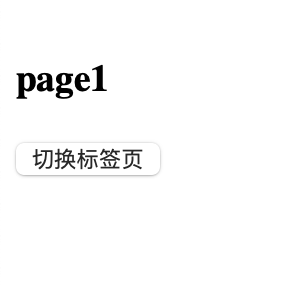
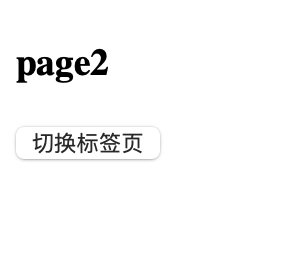

## 目录

- [组件页面切换](#组件页面切换)


## 组件页面切换

- `App.vue`

```vue
<template></template>
<!--  这里显示 tabComponent 组件页面-->
<component :is="tabComponent"></component>
  <button @click="changHandle">切换标签页</button>
</template>


<script>
// import 是引入组件， 组件名必须和文件名一致
import page1 from "@/dynamicComponents/page1.vue"
import page2 from "@/dynamicComponents/page2.vue"
export default{
  // components  注入组件
  components:{
    page1,
    page2
  },
  data(){
    return{
      // 将page1 页面赋值给tabComponent 于指定当前页面的标签组件名
      // 一定要传输组件的字符串名
      tabComponent:"page1",
    }
  },
  methods:{
    changHandle(){
      // 这里进行页面的切换判断
      this.tabComponent  =  this.tabComponent === "page1" ?  "page2" : "page1";
    }
  }
}
</script>
```

- 子组件  `page1.vue`

```vue
<template>
  <h3>page1</h3>
</template>

<script>
</script>
```

- 子组件  `page2.vue`

```vue
<template>
  <h3>page2</h3>
</template>

<script>
</script>
```

- 显示效果：



点击按钮后：


