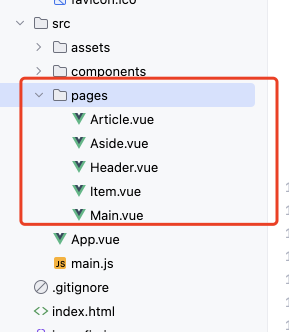
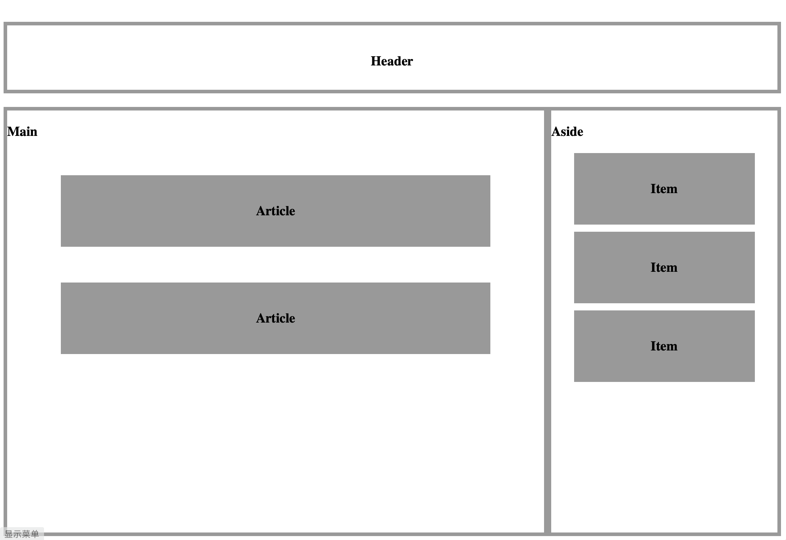

## 目录

- [页面组合](#页面组合)


## 页面组合

- pages 目录下的内容是这次需要的文件.



- 基础架构：
  - Main 文件 组件 包括  `Article.vue`
  - Aside 文件 组件 包括  `Item.vue`
  - App  文件 组件 包括 `Header.vue  Main.vue  Aside.vue`

### 代码如下

- `Article.vue`

```vue
<template>
    <h3>Article</h3>
</template>

<style scoped>
h3 {
  width: 80%;
  margin: 0 auto;
  text-align: center;
  line-height: 100px;
  box-sizing: border-box;
  margin-top: 50px;
  background: #999;
}
</style>
```

- ` Aside.vue `

```vue
<template>
  <div class="aside">
    <h3>Aside</h3>
    <Item/>
    <Item/>
    <Item/>
  </div>
</template>

<script >
import Item from './Item.vue'
export default {
  components:{
    Item
  }
}
</script>

<style scoped>
.aside {
  float: right;
  width: 30%;
  height: 600px;
  border: 5px solid #999;
  box-sizing: border-box;
}
</style>
```

- `Header.vue`

```vue
<template>
  <h3>Header</h3>
</template>

<script>

</script>

<style scoped>
h3{
  width: 100%;
  height: 100px;
  border: 5px solid #999;
  text-align: center;
  line-height: 100px;
  box-sizing: border-box;
}
</style>
```

- `Item.vue`

```vue
<script>

</script>

<template>
  <h3>Item</h3>
</template>

<style scoped>
h3{
  width: 80%;
  margin: 0 auto;
  text-align: center;
  line-height: 100px;
  box-sizing: border-box;
  margin-top: 10px;
  background: #999;
}
</style>
```

- `Main.vue`

```vue
<template>
<div class="main">
  <h3>Main</h3>
  <Article/>
  <Article/>
</div>
</template>

<script >
import Article from  './Article.vue'
export default {
  components:{
    Article
  }
}
</script>

<style scoped>
.main{
  float: left;
  width: 70%;
  height: 600px;
  border: 5px solid #999;
  box-sizing: border-box;
}
</style>
```

- `App.vue`

```vue
<template>
  <Header/>
  <Main/>
  <Aside/>
</template>


<script>
// import 是引入组件， 组件名必须和文件名一致
import Header from "./pages/Header.vue";
import Main from "./pages/Main.vue";
import Aside from "./pages/Aside.vue";


export default{
  // components  注入组件
  components:{
    Header:Header,
    Main:Main,
    Aside:Aside,
  },
  data(){
    return {
      message :"组件基础组成"
    }
  }
}
</script>
```

- 显示效果：


